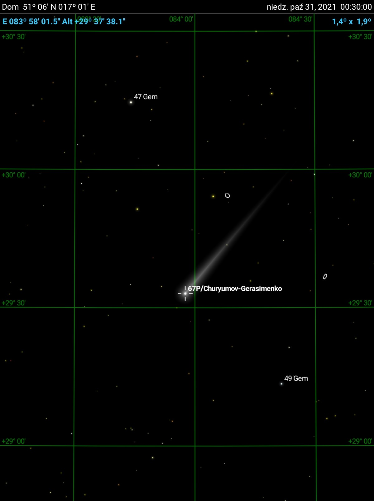

## Project: catch 67p comet (Churyumov-Gerasimenko)

- Timestamp: 22:34 30.10.2021 - 00:30 31.10.2021.
- Camera: ASI183MM
- Telescope: Classical Cassegrain, aperture 200mm, focal 2450mm
- Mount: SkyWatcher EQ6-R, guided via PHD + 50/216 scope + ASI120MM
- Sky: Bortle 9
- Exposure time: 60s
- Postprocessing: GIMP, only stretched using 'curves'; photos aligned using "align_image_stack" [https://wiki.panotools.org/Align_image_stack](https://wiki.panotools.org/Align_image_stack)

Comet 67p was around 10mag bright that day. At 22:34 was on 12.25deg elevation, at 00:30 was on 29.5deg above horizon.

And youtube video with animation:
[https://www.youtube.com/watch?v=WcR4X8jhQLo](https://www.youtube.com/watch?v=WcR4X8jhQLo)

And here is single photo with coordinates grid (make it larger to see details and TYC star names):

