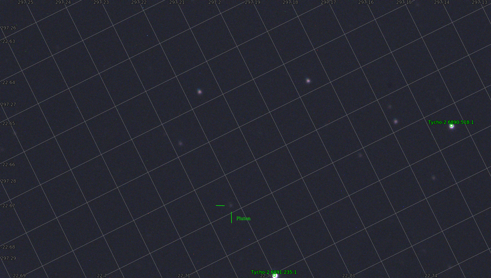

## Pluto 29.07.2021

Dwarf planet, catchet 29.07.2021, at 23:50 local time, brightness +14.3m. Position: RA 19h50m, DEC -22d38m, local: AZ 175d09m, ALT +16d10m. Easiest way to catch this planet is to wait until move closer to any star from Tycho2 catalogue. Then it's few minutes to find it (using GOTO, computer, platesolve and camera obviously). Pluto moves preety quickly so at least you'll have to wait few days for better position.

Image is a single 16-bit frame from ASI462, 20s exposure, gain 400. Telescope: Classical Cassegrain 200/2450 on DIY EQ5 GOTO, full spectrum (without any filters). The planet was only 16deg above horizon so atmosferic dispersion can be seen preety clearly because IMX462C is preety sensitive in IR band. Two brightest stars are: closer one Tyc 6891-0235-1 which have 10.6 magm, further one Tyc 6890-0518-1 which have 12.1m. With IR-cut filter brightness of the planet dropped heavily.

Link to sky fragment with marked frame bounds:

[https://www.legacysurvey.org/viewer/?ra=297.2099&dec=-22.6837&layer=unwise-neo6&poly=297.2565,-22.6202,297.1269,-22.6793,297.1633,-22.7472,297.2928,-22.6880,297.2565,-22.6202](https://www.legacysurvey.org/viewer/?ra=297.2099&dec=-22.6837&layer=unwise-neo6&poly=297.2565,-22.6202,297.1269,-22.6793,297.1633,-22.7472,297.2928,-22.6880,297.2565,-22.6202)

and to astrometry: [https://nova.astrometry.net/user_images/4958107#annotated](https://nova.astrometry.net/user_images/4958107#annotated)

Field 8.02 x 4.54 arcmin, diameter: 0.077deg, calculated scale: 0.249

WCS file: [wcs.fits](wcs.fits)

